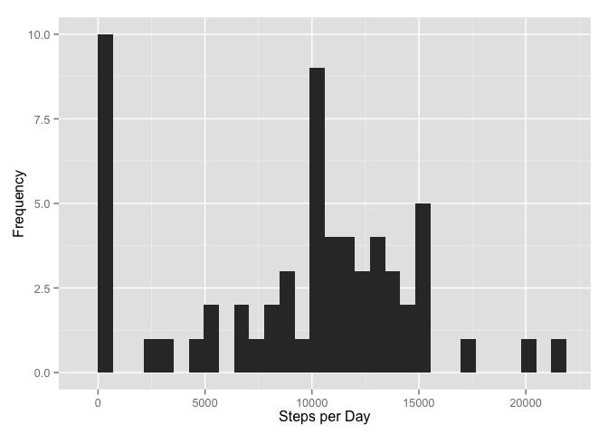
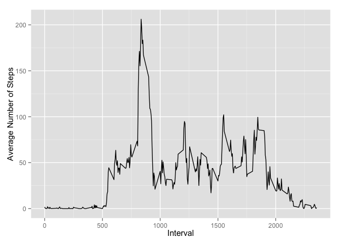
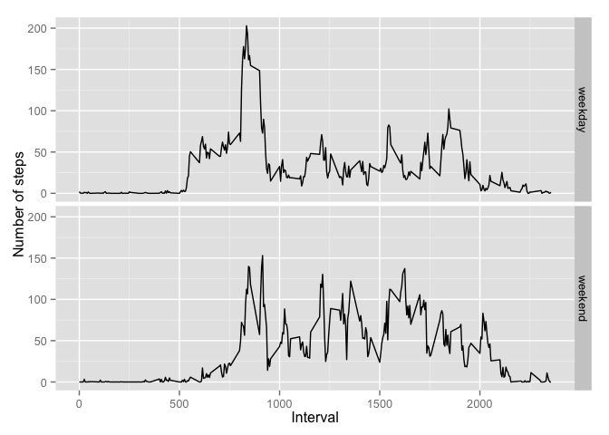

# Assessment

##1) Read the data


```r
act<-read.csv("activity.csv")
```

##2) Mean total number of steps per day

### Histogram:


```r
stepsbyday<-aggregate(act$steps,list(act$date),sum,na.rm=TRUE)
library("ggplot2")
qplot(stepsbyday$x,xlab="Steps per Day",ylab="Frequency")
```

```
## stat_bin: binwidth defaulted to range/30. Use 'binwidth = x' to adjust this.
```

 

### Mean:


```r
mean(stepsbyday$x)
```

```
## [1] 9354.23
```

### Median:


```r
median(stepsbyday$x)
```

```
## [1] 10395
```

##3) Average Daily Activity Pattern


```r
avgint<-aggregate(act$steps,list(act$interval),mean,na.rm=TRUE)
qplot(avgint$Group.1,avgint$x,geom="line",xlab="Interval",ylab="Average Number of Steps")
```

 

```r
avgint[avgint$x==max(avgint$x),]
```

```
##     Group.1        x
## 104     835 206.1698
```

=> The interval for which the average is maximum is 835

##4) Imputing the missing values

### Number of rows with missing values: 


```r
sum(is.na(act))
```

```
## [1] 2304
```

### Filling missing values with daily averages


```r
avgdate<-aggregate(act$steps,list(act$date),mean,na.rm=TRUE)
avgdate[is.na(avgdate$x),]$x<-0 # Filling NA averages with 0
av<-avgdate[rep(seq_len(nrow(avgdate)), each=288),]
act2<-act
act2[is.na(act2$steps),]$steps<-av[is.na(act2$steps),]$x 
```

"act2" is the new dataset with all missing values filled with daily averages


```r
stepsbyday2<-aggregate(act2$steps,list(act2$date),sum,na.rm=TRUE)
qplot(stepsbyday2$x,xlab="Steps per Day",ylab="Frequency")
```

```
## stat_bin: binwidth defaulted to range/30. Use 'binwidth = x' to adjust this.
```

 

Mean:


```r
mean(stepsbyday2$x)
```

```
## [1] 9354.23
```

Median:


```r
median(stepsbyday2$x)
```

```
## [1] 10395
```

These values do not differ from the earlier values in the assignment as all NA values have been replaced by values which are the mean of the daily values anyways.

##5) Differences between weekday and weekend activity patterns


```r
act2$week<- "weekday"
act2[weekdays(as.Date(act2$date),TRUE)=="Sat" | weekdays(as.Date(act2$date),TRUE)=="Sun", ]$week<-"weekend"
act2$week<-as.factor(act2$week)
avgint2<-aggregate(act2$steps,list(act2$interval,act2$week),mean,na.rm=TRUE)
ggplot(avgint2,aes(x=Group.1,y=x))+geom_line()+facet_grid(Group.2~.)+xlab("Interval")+ylab("Number of steps")
```

 

